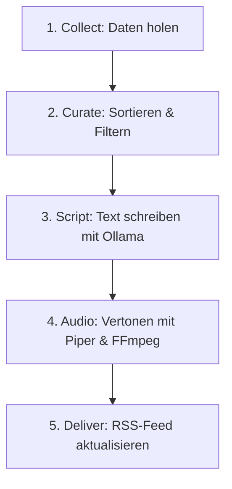

# Briefly 🎙️


**Briefly** ist dein persönliches, tägliches Audio-Briefing („Daily Cast“). Jeden Morgen generiert Briefly vollautomatisch eine ca. 10-minütige Podcast-Folge, maßgeschneidert aus deinen Kalendern, Wettervorhersagen, Lieblings-RSS-Feeds (Nachrichten) und deinen persönlichen Notizen.

Briefly läuft **vollkommen lokal und privat** auf deinem Computer (macOS oder Windows) – keine Daten verlassen deinen Rechner. Die fertige Folge abonnierst du einfach mit deiner bevorzugten Podcast-App auf dem Smartphone.

---

## 🚀 Erste Folge in 5 Minuten (Schnellstart)

Sobald Briefly installiert ist, kannst du sofort loslegen:

1. **Web-Oberfläche starten:** Öffne ein Terminal- oder PowerShell-Fenster im Briefly-Ordner und tippe ein:
   ```bash
   briefly start
   ```
2. **Dashboard öffnen:** Öffne deinen Internet-Browser und rufe auf: [http://localhost:8787](http://localhost:8787).
3. **Folge erzeugen:** Klicke auf den großen Button **„Neue Folge erzeugen“**. Die Statusanzeige springt auf ⏳ *„Neue Folge wird gerade erzeugt...“*.
4. **Anhören:** Nach ca. 2 bis 3 Minuten aktualisiert sich die Seite. Du siehst die fertige Folge des Tages, kannst sie direkt im Browser abspielen oder als M4B-Audiodatei herunterladen.

---

## 📥 Installation

Am einfachsten installierst du Briefly mit dem automatischen Einzeilen-Installer. Dieser überprüft dein System, installiert fehlende Programme (wie Python, FFmpeg oder die KI) automatisch und richtet die Arbeitsumgebung ein.

### 🍏 macOS (Apple Silicon & Intel)
Öffne das Terminal und füge folgenden Befehl ein:
```bash
curl -fsSL https://raw.githubusercontent.com/AnselmJo/briefly/main/install.sh | bash
```
*Tipp: Du kannst vorab mit einem Testlauf (Dry Run) prüfen, was der Installer tun würde:*
```bash
curl -fsSL https://raw.githubusercontent.com/AnselmJo/briefly/main/install.sh | bash -s -- --dry-run
```

### 🔌 Windows 10 / 11
Öffne die PowerShell und füge folgenden Befehl ein:
```powershell
irm https://raw.githubusercontent.com/AnselmJo/briefly/main/install.ps1 | iex
```
*Tipp: Du kannst vorab einen Testlauf (Dry Run) durchführen:*
```powershell
& ([scriptblock]::Create((irm https://raw.githubusercontent.com/AnselmJo/briefly/main/install.ps1))) -DryRun
```

---

<details>
<summary><b>🛠️ Manuelle Installation (Alternative & Fehlerbehebung)</b></summary>

Falls die automatische Einzeilen-Installation fehlschlägt oder du die Schritte manuell durchführen möchtest, kannst du dieser Anleitung folgen:

### Manuelle Installation auf macOS:

#### Schritt 1: Programme & Werkzeuge installieren
Du brauchst ein Paket-Verwaltungsprogramm namens **Homebrew**, um Python, FFmpeg (für Audio) und Ollama (für die KI) zu installieren.
1. Drücke `Cmd + Leertaste`, tippe **Terminal** ein und öffne die Terminal-App.
2. Kopiere folgenden Befehl, füge ihn im Terminal ein und drücke `Enter`:
   ```bash
   /bin/bash -c "$(curl -fsSL https://raw.githubusercontent.com/Homebrew/install/HEAD/install.sh)"
   ```
3. Installiere anschließend die benötigten Programme mit diesem Befehl:
   ```bash
   brew install python ffmpeg ollama git
   ```

#### Schritt 2: Ollama starten
1. Öffne **Ollama** über deine macOS Spotlight-Suche (`Cmd + Leertaste` -> Ollama). Ein kleines Lama-Symbol erscheint oben rechts in deiner Menüleiste. Stelle sicher, dass der Dienst aktiv ist.

#### Schritt 3: Briefly herunterladen & einrichten
1. Kopiere das Briefly-Repository auf deinen Mac:
   ```bash
   git clone https://github.com/AnselmJo/briefly.git
   ```
2. Navigiere in den Briefly-Ordner:
   ```bash
   cd briefly
   ```
3. Erstelle eine isolierte Python-Umgebung und aktiviere sie:
   ```bash
   python3 -m venv .venv
   source .venv/bin/activate
   ```
4. Installiere Briefly und starte den automatischen Einrichtungs-Assistenten:
   ```bash
   pip install -e .
   briefly install
   ```

### Manuelle Installation auf Windows:

#### Schritt 1: Systemprogramme installieren
Unter Windows nutzen wir den Paketmanager `winget`.
1. Drücke die `Windows-Taste`, tippe **PowerShell** ein, mache einen Rechtsklick auf *Windows PowerShell* und wähle **Als Administrator ausführen**.
2. Kopiere diesen Befehl in das PowerShell-Fenster und drücke `Enter`:
   ```powershell
   winget install Python.Python.3.12 Gyan.FFmpeg Ollama.Ollama Git.Git
   ```
3. Schließe das PowerShell-Fenster und öffne ein neues (ohne Administratorrechte).

#### Schritt 2: Ollama starten
1. Starte **Ollama** über dein Windows-Startmenü. Vergewissere dich, dass Ollama im Hintergrund aktiv ist (Lama-Symbol in der Taskleiste).

#### Schritt 3: Briefly herunterladen & einrichten
1. Lade Briefly auf deinen PC herunter:
   ```bash
   git clone https://github.com/AnselmJo/briefly.git
   ```
2. Navigiere in den Ordner:
   ```bash
   cd briefly
   ```
3. Erstelle eine Python-Umgebung und aktiviere sie:
   ```bash
   python -m venv .venv
   .venv\Scripts\Activate.ps1
   ```
4. Installiere Briefly und führe die automatische Einrichtung aus:
   ```bash
   pip install -e .
   briefly install
   ```
   *Der Assistent lädt nun die nötigen deutschen Stimmen herunter und bereitet deine `config.yaml` Konfigurationsdatei vor.*

</details>

---

## 📱 Verbindung mit dem Smartphone (z. B. AntennaPod)

Du kannst Briefly auf deinem iPhone oder Android-Handy abonnieren, solange sich das Handy im selben WLAN wie dein Computer befindet.

1. **Server starten:** Stelle sicher, dass Briefly im Hintergrund läuft (`briefly start` ausgeführt auf dem Mac/PC).
2. **RSS-Link kopieren:** Klicke auf dem Web-Dashboard (`http://localhost:8787`) im Abschnitt *„Podcast abonnieren“* auf **Kopieren**.
3. **In Podcast-App eintragen:**
   - Öffne eine Podcast-App (wir empfehlen die kostenfreie App **AntennaPod** für Android oder **Apple Podcasts** / **Overcast** für iOS).
   - Wähle *„Podcast per RSS-Feed/URL hinzufügen“*.
   - Füge die kopierte Adresse ein (z. B. `http://192.168.178.20:8787/feed.xml`) und klicke auf Abonnieren.
4. **Hören:** Deine neu generierten Episoden erscheinen automatisch in deiner App inklusive passender Kapitelmarken.

---

## 🧩 Die Abschnitte (Segments) erklärt

Briefly stellt deine Episoden modular aus folgenden Abschnitten zusammen. Du kannst jeden Abschnitt im Web-Interface unter **Segments** ein- oder ausschalten und verschieben:

*   **Begrüßung & Datum (Greeting):** Begrüßt dich namentlich, nennt das aktuelle Datum und den Wochentag.
*   **Einleitung & Stimmung (Intro):** Ein kurzer, motivierender Spruch, um positiv in den Tag zu starten.
*   **Wetterbericht (Weather):** Ruft die aktuelle Vorhersage für deinen konfigurierten Standort ab.
*   **Kalender (Calendar):** Listet deine heutigen Termine und Geburtstage auf (integrierbar mit Google Kalender, iCloud und Outlook über ICS-Links).
*   **Hauptnachrichten (News):** Liest die wichtigsten Meldungen aus deinen konfigurierten RSS-Nachrichtenquellen vor.
*   **Weitere Themen (Topics):** Weitere Artikel aus Technik, Sport oder Wissenschaft.
*   **Persönliche Notizen (Inbox):** Liest deine Notizen oder Buchzusammenfassungen vor, die du im Tab *Sources* eingetragen hast.
*   **Tägliche Affirmation (Affirmation):** Ein positiver Glaubenssatz für deinen Tag.
*   **Interessanter Fakt (Fun Fact):** Ein kurzer, überraschender Wissensfakt zum Schmunzeln.
*   **Verabschiedung (Outro):** Ein netter Abschiedsgruß, der dynamisch Bezug auf das Wetter oder anstehende Termine nimmt.

---

## ⚙️ Aktualisierung & Wartung

Wenn eine neue Version von Briefly erscheint, kannst du diese ganz leicht aktualisieren:

1. Öffne dein Terminal- oder PowerShell-Fenster im Briefly-Ordner.
2. Führe diese Befehle nacheinander aus:
   ```bash
   git pull origin main
   pip install -e .
   ```
3. Starte danach deinen Webserver mit `briefly restart` neu.

---

## 🛠️ Fehlerbehebung (Troubleshooting)

Falls etwas mal nicht funktioniert, nutze das eingebaute Diagnose-Tool. Es überprüft alle Dienste, Stimmen und Pfade auf Fehler:
```bash
briefly doctor
```

Hier sind die häufigsten 10 Probleme und wie du sie löst:

<details>
<summary><b>1. Fehler: "Befehl nicht gefunden" (Command not found)</b></summary>
Deine virtuelle Python-Umgebung ist nicht aktiv. Führe im Briefly-Ordner aus:
- **macOS:** `source .venv/bin/activate`
- **Windows:** `.venv\Scripts\Activate.ps1`
</details>

<details>
<summary><b>2. Die Audio-Generierung bleibt bei 0% hängen oder bricht ab</b></summary>
Stelle sicher, dass **Ollama** im Hintergrund gestartet ist und das Sprachmodell geladen wurde. Teste es, indem du `ollama run qwen3:8b` im Terminal ausführst und prüfst, ob du eine Antwort erhältst.
</details>

<details>
<summary><b>3. Die Web-Oberfläche ist auf dem Handy nicht erreichbar</b></summary>
Dein Handy und dein Rechner müssen sich im selben WLAN befinden. Vergewissere dich außerdem, dass keine Firewall auf deinem Computer den Port `8787` blockiert. Die korrekte lokale IP-Adresse wird dir im Web-Dashboard angezeigt.
</details>

<details>
<summary><b>4. Fehler: "Not a valid RSS/Atom feed" im Tab "Sources"</b></summary>
Die eingegebene URL ist kein echter News-Feed, sondern eine normale Website. Suche auf der Website nach einem RSS-Symbol oder einer URL, die auf `.xml`, `.rss` oder `/feed` endet.
</details>

<details>
<summary><b>5. Fehlende Stimme: "Piper voice not found"</b></summary>
Der Einrichtungsassistent konnte die Stimmen nicht laden. Führe diesen Befehl aus, um die deutsche Stimme manuell herunterzuladen:
```bash
python -m piper.download_voices de_DE-thorsten-medium --data-dir data/voices
```
</details>

<details>
<summary><b>6. Kalender-Termine werden nicht vorgelesen</b></summary>
Prüfe die ICS-Link-URL in deiner `config.yaml`. Der Link muss öffentlich zugänglich sein (z. B. der iCal-Privatlink von Google Kalender) und direkt auf eine Datei verweisen, die mit `.ics` endet.
</details>

<details>
<summary><b>7. Die Audiowiedergabe knackt oder klingt abgehackt</b></summary>
Öffne die Einstellungen (Settings) in Briefly und passe das Sprechtempo (`length_scale` auf `1.05` oder `1.1`) sowie die Satzpausen (`sentence_pause_ms` auf `300`) an, um der Stimme mehr Natürlichkeit zu verleihen.
</details>

<details>
<summary><b>8. ffmpeg Fehler: "ffmpeg not installed"</b></summary>
FFmpeg wird benötigt, um die Audiodateien zusammenzufügen. Installiere es:
- **macOS:** `brew install ffmpeg`
- **Windows:** Öffne PowerShell als Admin und tippe `winget install Gyan.FFmpeg`.
</details>

<details>
<summary><b>9. Windows-Skriptausführung blockiert (Execution Policy)</b></summary>
Windows blockiert standardmäßig das Ausführen von Aktivierungsskripten. Löse dies in PowerShell mit:
```powershell
Set-ExecutionPolicy -ExecutionPolicy RemoteSigned -Scope CurrentUser
```
</details>

<details>
<summary><b>10. Änderungen in der Web-Oberfläche werden nicht übernommen</b></summary>
Möglicherweise hat der Webserver keine Schreibrechte im Briefly-Ordner. Stelle sicher, dass du Lese- und Schreibrechte besitzt und starte den Server mit `briefly restart` neu.
</details>

---

## ❓ Häufig gestellte Fragen (FAQ)

<details>
<summary><b>Kostet Briefly Geld oder benötigt es Internetabos?</b></summary>
Nein. Briefly ist komplett kostenlos. Die gesamte Textgenerierung (Ollama) und die Sprachausgabe (Piper) laufen zu 100% lokal auf deiner eigenen Hardware. Internet wird nur benötigt, um deine Wetterdaten, Kalender-Feeds und RSS-Nachrichten abzurufen.
</details>

<details>
<summary><b>Wie kann ich Briefly jeden Morgen vollautomatisch laufen lassen?</b></summary>
Der Einrichtungsassistent (`briefly install`) frägt dich am Ende, ob die macOS `launchd`-Dienste eingerichtet werden sollen. Unter Windows kannst du Briefly über die *Windows-Aufgabenplanung* (Task Scheduler) so konfigurieren, dass nachts ein Skript mit `briefly run` ausgeführt wird.
</details>

<details>
<summary><b>Welche Stimmen stehen zur Verfügung?</b></summary>
Briefly nutzt Piper, das hunderte extrem performante Stimmen unterstützt. Standardmäßig lädt Briefly die Stimme `de_DE-thorsten-medium` herunter, die sehr flüssiges Deutsch spricht. Du kannst in den Einstellungen auch eine englische Stimme konfigurieren.
</details>

---

## 🏗️ System-Architektur (Für Neugierige)

Briefly arbeitet in einer fünfstufigen Pipeline:



1. **Sammeln (Collect):** Holt RSS-Einträge, ICS-Kalendertermine und Inbox-Notizen ab.
2. **Kuratieren (Curate):** Entfernt Duplikate, sortiert Beiträge nach Wichtigkeit und passt die Auswahl an dein Zeitbudget an.
3. **Skript (Script):** Ein lokales LLM (z. B. Qwen) formuliert aus den nackten Rohdaten ein natürlich fließendes Radio-Skript mit geschmeidigen Überleitungen.
4. **Audio (Audio):** Der TTS-Synthesizer Piper wandelt das fertige Skript satzweise in Sprache um. FFmpeg fügt diese zu einer M4B-Hörbuchdatei inklusive Kapitelmarken zusammen.
5. **Ausliefern (Deliver):** Der lokale Webserver aktualisiert die Podcast-XML-Datei, sodass dein Smartphone die neue Folge sofort herunterladen kann.
