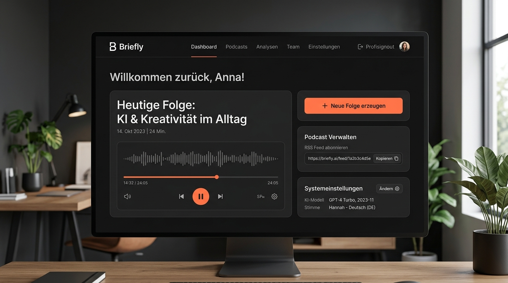

# Briefly



Persönliches tägliches Audio-Briefing ("Daily Cast"): eine automatisch
generierte, ~10-minütige Sprachfolge aus News, Wissens-Themen und eigenen
Inbox-Einträgen (Notizen, Buchzusammenfassungen, Links), ausgeliefert als
abonnierbarer RSS-Feed. Läuft komplett lokal auf einem Mac (Apple Silicon).

> „Briefly – deine Themen, kurz und persönlich gesprochen, jeden Morgen."

Eingaben/Einstellungen erfolgen über eine Web-Oberfläche, die im Heim-WLAN
von macOS, iOS, Windows und Android aus per Browser erreichbar ist. Die
Wiedergabe (bevorzugt Android) erfolgt über eine bestehende Podcast-App wie
[AntennaPod](https://antennapod.org/) – Briefly liefert nur den RSS-Feed und
die Audiodateien mit Kapitelmarken, keine eigene App.

## Voraussetzungen

- macOS auf Apple Silicon oder Windows, Python 3.12+
- [Ollama](https://ollama.com) installiert (Modell gezogen: `ollama pull qwen3:8b`)
  - Windows: [Ollama für Windows](https://ollama.com) herunterladen und ausführen
- `ffmpeg` installiert
  - macOS: `brew install ffmpeg`
  - Windows: `winget install Gyan.FFmpeg` oder über Chocolatey: `choco install ffmpeg`
- Piper-Stimmen heruntergeladen (siehe unten)

## Installation und Einrichtung

Um Briefly einzurichten, führe die folgenden Schritte aus. Der integrierte Setup-Assistent führt dich durch die Diagnose und konfiguriert alle Pfade, Verzeichnisse und optionalen launchd-Hintergrunddienste automatisch.

1. **Virtuelle Umgebung erstellen und Abhängigkeiten installieren:**

   ```bash
   python3 -m venv .venv
   source .venv/bin/activate
   pip install -e ".[dev]"
   ```

2. **Setup-Assistent ausführen:**

   ```bash
   briefly install
   ```

   Der Assistent prüft:
   - Fehlende Python-Abhängigkeiten
   - Ollama-Installation und den Status des Hintergrunddienstes
   - Vorhandensein des LLM-Modells (Default: `qwen3:8b`)
   - Download-Status der Piper-Stimmen (DE + EN)
   - Vorhandensein von `ffmpeg`
   - Schreibrechte in den Arbeitsverzeichnissen

   Er führt außerdem folgende Schritte automatisch durch:
   - Erstellt `config.yaml` aus dem Template (und trägt automatisch die lokale IP-Adresse deines Macs für `delivery.base_url` ein)
   - Erstellt alle benötigten Arbeits- und Ausgabeordner
   - Generiert die `launchd`-Konfigurationsdateien für macOS in `output/`
   - Frägt, ob die macOS `launchd`-Dienste installiert werden sollen (für den täglichen nächtlichen Lauf um 05:30 Uhr und den Webserver im Hintergrund)

3. **Fehlende Komponenten herunterladen (falls vom Assistenten gemeldet):**

   - **Ollama Modell:**
     ```bash
     ollama pull qwen3:8b
     ```
   - **Piper-Stimmen:**
     ```bash
     python -m piper.download_voices de_DE-thorsten-medium --data-dir data/voices
     python -m piper.download_voices en_US-lessac-medium --data-dir data/voices
     ```


## Nutzung

Pipeline manuell einmal komplett durchlaufen lassen:

```bash
briefly run
```

Einzelne Stufen (Briefing §2.7 – jede Stufe separat testbar):

```bash
briefly collect
briefly curate
briefly script
briefly audio
briefly deliver
```

### System-Diagnose

Um den Zustand deines Systems und der konfigurierten Dienste zu prüfen, steht das Diagnose-Tool `briefly doctor` bereit. Es führt automatische Tests für alle benötigten Systemressourcen, Verbindungen, Modelle, Stimmen und Dienste durch und gibt Empfehlungen zur Fehlerbehebung:

```bash
briefly doctor
```

### Konfiguration und Sprachqualität-Optimierung (TTS)

Briefly enthält eine integrierte Text-Bereinigung (Preprocessing) vor der Sprachausgabe durch Piper. Diese entfernt automatisch störende Formatierungen wie Markdown (Auszeichnungen, Links, Überschriften, Listenpunkte), HTML-Tags, Code-Blöcke, Tabellen und Emojis, normalisiert die Interpunktion (z.B. Anführungszeichen, Bindestriche, mehrfache Satzzeichen) und Leerzeichen, und expandiert sprachspezifisch gängige Abkürzungen (z.B. "z.B." zu "zum Beispiel" im Deutschen, "e.g." zu "for example" im Englischen) für eine flüssige Audio-Ausgabe.

Zusätzlich können über die Web-Oberfläche (unter Einstellungen) oder direkt in der `config.yaml` folgende Werte konfiguriert werden, um die Sprachqualität und den Lesefluss zu optimieren:

```yaml
tts:
  # Sprechgeschwindigkeit (Standard: null oder 1.0; < 1.0 ist schneller, > 1.0 langsamer)
  length_scale: 1.0
  # Zusätzliche Pause in Millisekunden nach Satzenden (z.B. 250)
  sentence_pause_ms: 250
  # Zusätzliche Pause in Millisekunden nach Absatzenden (z.B. 600)
  paragraph_pause_ms: 600
```


Web-Oberfläche im Hintergrund starten (Eingaben/Einstellungen + Feed-Auslieferung):

```bash
briefly start
```

Du kannst den Dienst steuern und überprüfen mit:
- `briefly stop` (stoppt den Webserver)
- `briefly status` (zeigt den aktuellen System- und Server-Status)
- `briefly restart` (startet den Webserver neu)

Danach von einem beliebigen Gerät im selben Heim-WLAN
`http://<mac-lan-ip>:8787` öffnen.

## Automatischer nächtlicher Lauf (launchd + pmset)

1. Mac so einstellen, dass er nachts aufwacht:

   ```bash
   sudo pmset repeat wakeorpoweron MTWRFSU 05:25:00
   ```

2. Platzhalter in den `scripts/launchd/*.plist`-Dateien ersetzen
   (`__PROJECT_DIR__` = absoluter Projektpfad, `__PYTHON_BIN__` = Pfad zum
   venv-Python, z.B. `which python` nach `source .venv/bin/activate`).

3. Installieren:

   ```bash
   cp scripts/launchd/com.briefly.dailyrun.plist ~/Library/LaunchAgents/
   cp scripts/launchd/com.briefly.web.plist ~/Library/LaunchAgents/
   launchctl load ~/Library/LaunchAgents/com.briefly.dailyrun.plist
   launchctl load ~/Library/LaunchAgents/com.briefly.web.plist
   ```

Der Web-Server (`com.briefly.web`) läuft danach dauerhaft im Hintergrund und
ist im Heim-WLAN erreichbar; der nächtliche Lauf (`com.briefly.dailyrun`)
erzeugt jeden Morgen automatisch eine neue Episode.

## Wiedergabe auf Android Smartphone (AntennaPod)

1. [AntennaPod](https://antennapod.org/) installieren (F-Droid oder Play Store).
2. Im selben Heim-WLAN wie der Mac: Feed abonnieren unter
   `http://<mac-lan-ip>:8787/feed.xml`.
3. Neue Episoden erscheinen automatisch nach jedem nächtlichen Lauf, inkl.
   Kapitelmarken zum Springen zwischen Segmenten.

## Kalender-Integration (ICS Feeds)

Das `calendar`-Segment liest Termine und Geburtstage aus ICS-Feeds oder lokalen `.ics`-Dateien aus. Du kannst ICS-Feed-URLs von den gängigsten Kalender-Diensten erhalten:

### 1. Google Calendar
1. Öffne [Google Calendar](https://calendar.google.com/) im Web.
2. Gehe zu **Einstellungen** (Zahnrad-Symbol oben rechts) > **Einstellungen**.
3. Wähle in der linken Leiste deinen Kalender unter **Einstellungen für meine Kalender** aus.
4. Scrolle ganz nach unten zum Bereich **Kalender integrieren**.
5. Kopiere die URL aus dem Feld **Privatadresse im iCal-Format** (endet auf `.ics`).
   * *Hinweis: Verwende nicht die öffentliche Adresse, außer dein Kalender ist komplett öffentlich freigegeben.*

### 2. Outlook.com / Microsoft 365
1. Öffne Outlook im Web.
2. Gehe zu **Einstellungen** (Zahnrad-Symbol oben rechts) > **Kalender** > **Geteilte Kalender** (oder **Kalender veröffentlichen**).
3. Wähle unter **Kalender veröffentlichen** den gewünschten Kalender und die Berechtigung (z. B. "Kann alle Details sehen") aus.
4. Klicke auf **Veröffentlichen**.
5. Kopiere die generierte **ICS-Link-URL**.

### 3. Apple iCloud Calendar
1. Öffne die Kalender-App auf macOS/iOS oder gehe zu [iCloud.com](https://www.icloud.com/).
2. Klicke neben dem Namen des Kalenders auf das **Teilen-Symbol** (Funkwellen-Symbol).
3. Aktiviere **Öffentlicher Kalender**.
4. Kopiere die bereitgestellte Webcal-URL und ändere das Protokoll am Anfang von `webcal://` zu `https://`.

## Tests

```bash
pytest
```

Läuft auch ohne installiertes Ollama/Piper grün (Provider werden in den
Pipeline-Tests durch Test-Doubles ersetzt). `test_audio.py` überspringt sich
selbst, wenn `ffmpeg` nicht verfügbar ist.

## Architektur

Siehe [`CLAUDE.md`](./CLAUDE.md) für die Provider-Abstraktion und
Code-Stil-Regeln, sowie [`docs/concept/`](./docs/concept/) für die
ursprünglichen Konzeptdokumente (Briefing, Setup-Empfehlungen, Branding).
